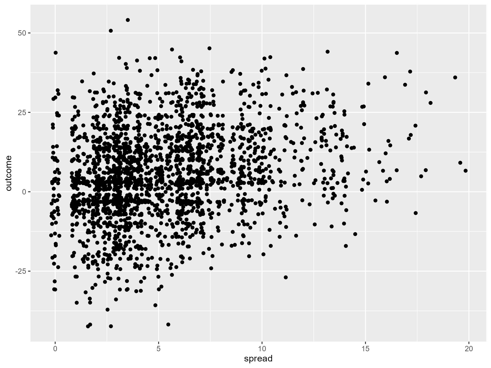

# Football Bayesian Analysis
This project explores the football.csv dataset to investigate whether the perceived difference in ability between two teams has an affect on the predictability of the outcome.

Before a game, experts predict how many points the "better team" should win by. A point *spread* of 2 represents that the better team is expected to win by 2 points. The *outcome* variable represents the final score of the perceived "better team" minus the score obtained by the opposite team. An outcome of 2 means the "better team" won by two points

> 1) Does the spread predict the average outcome?
> 2) Does the spread predict how variable the outcome is?

## Initial Exploration

There appears to be a **positive** relationship between spread (predictor) and outcome (response) which suggests the experts involved are good at predicting results. However, there are outcomes with a negative value indicating that the perceived "worse team" do win despite what the experts think.

The variability in outcomes looks consistent across different spread values.

