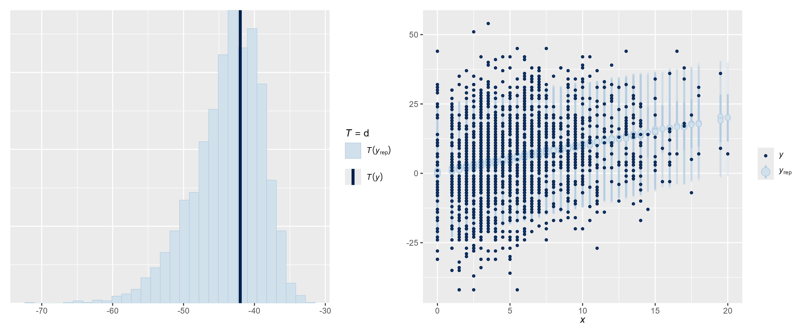

# Football Bayesian Analysis
This project explores the football.csv dataset to investigate whether the perceived difference in ability between two teams has an affect on the predictability of the outcome.

Before a game, experts predict how many points the "better team" should win by. A point *spread* of 2 represents that the better team is expected to win by 2 points. The *outcome* variable represents the final score of the perceived "better team" minus the score obtained by the opposite team. An outcome of 2 means the "better team" won by two points

> 1) Does the spread predict the average outcome?
> 2) Does the spread predict how variable the outcome is?

---

## Initial Exploration

There appears to be a **positive** relationship between spread (predictor) and outcome (response) which suggests the experts involved are good at predicting results. However, there are outcomes with a negative value indicating that the perceived "worse team" do win despite what the experts think.

The variability in outcomes looks consistent across different spread values.

---

## Bayesian Regression Model & Inference
A heteroscedastic model was used instead of a standard linear regression model to explore whether the variability of outcomes changes with the spread, rather than assuming it stays the same.

Using this model it is found that:
1. The spread strongly predicts the outcome, for every point of spread the expected outcome increases by ~ 1 point.
2. There is little to no evidence that the variability of the outcome changes with the spread. High spread games (large difference in strength between teams) do not appear to be more predictable than low spread games.

---

## Model Validation
For Bayesian analysis, posterior predictive checks (PPCs) can confirm if the model is capable of producing simulated data based on the observed data and thus is valid in its prediction.

Posterior predictive checks confirm:
1. The model generates simulated data consistent with the observed data.
2. The models uncertainty appropriately accounts for different spread values.

--- 

## Predictive Modelling
An additional method of ensuring the model performs as intended is to generate predictions for specific values of the spread and check that the predicted outcome is in line with the expected value. 

A new data point where spread = 16 was generated to test the model outside of the observed data. This resulted in a predicted median outcome of 16.48, closely matching the expected median outcome of 16.27 from the model's simulated values when spread = 16.
Both predictions had strongly overlapping and large 95% credible intervals, confirming that the model's predictions are robust and perform well beyond the observed data.

This reinforces the earlier findings that 
1. The spread is a strong predictor of the average outcome.
2. The exact outcome can vary widely and so the spread cannot predict the variability of the outcome.

---

## Author
**Áirmid Murphy-Scott**

Statistics and Biology graduate.
